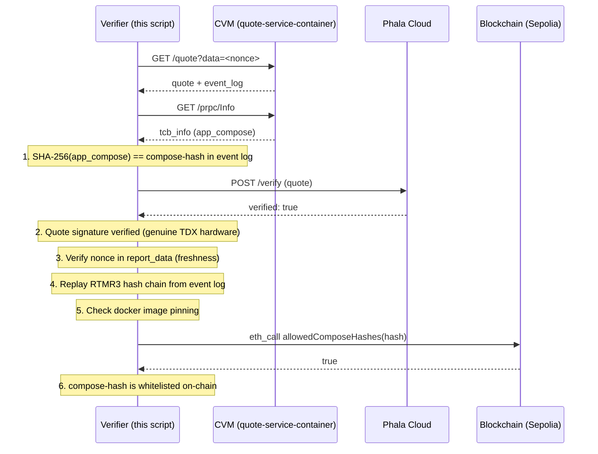

# dstack CVM Python Verifier

A Python client that performs end-to-end remote attestation verification of dstack Confidential Virtual Machines (CVMs). It proves that a specific application is running unmodified inside genuine Intel TDX hardware.

## Verification Steps

| Step | What it verifies | How |
|------|-----------------|-----|
| **1. Compose-hash** | Application configuration integrity | SHA-256 of `app-compose.json` matches the hash attested in RTMR3 event log |
| **2. Quote signature** | Genuine Intel TDX hardware | TDX quote verified by [Phala Cloud](https://cloud-api.phala.network) verification service |
| **3. Report data (nonce)** | Quote freshness | Random nonce sent at request time is bound in the quote's `report_data` field |
| **4. RTMR3 replay** | Event log integrity | Replays the hash chain from the event log and compares against the RTMR3 value in the quote |
| **5. Docker image digests** | Immutable container images | Checks that all images in docker-compose are pinned (not using mutable tags like `latest`) |
| **6. On-chain governance** | Authorized deployment | Queries the `DstackApp` smart contract on Sepolia to confirm the compose-hash is whitelisted |

## Prerequisites

```bash
pip install requests pyyaml pycryptodome
```

## Usage

```bash
ALCHEMY_API_KEY=<your-alchemy-key> python3 verifier.py
```

### Example Output

```
Nonce (hex): a4d7fd2fdd7291dc8283b8697bd642c520943f066ab7b216fcab14f3c6ab70a8
[OK] Step 1: compose-hash verified (8054dd675d0d0933da2951b962bde5dfed483a30a2b40de5b6aac163d68a9027)
[OK] Step 2: quote signature verified by Phala Cloud
[OK] Step 3: report_data verified (nonce bound to quote)
[OK] Step 4: RTMR3 replay verified (a71836bec211db65caa51c57914e9217bf0b412e...)
[OK] Step 6: on-chain governance verified (compose-hash whitelisted in DstackApp 0xdfc9...)
```

## Architecture



## References

- [dstack attestation docs](https://docs.phala.com/phala-cloud/attestation/verify-your-application)
- [Rust verifier implementation](https://github.com/Dstack-TEE/dstack/blob/main/verifier/src/verification.rs)
- [cc-eventlog runtime events](https://github.com/Dstack-TEE/dstack/blob/main/cc-eventlog/src/runtime_events.rs)
- [DstackApp smart contract](https://github.com/Dstack-TEE/dstack/blob/main/kms/auth-eth/contracts/DstackApp.sol)
