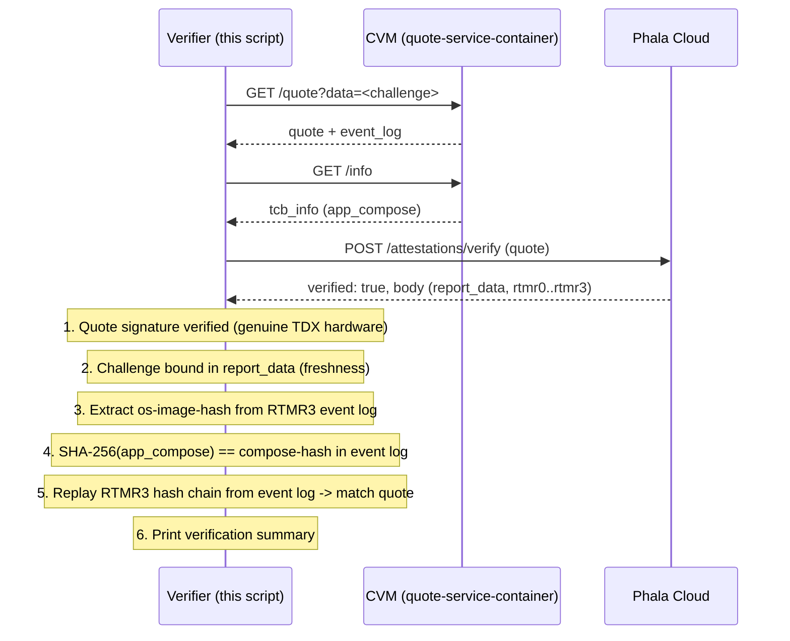

# dstack CVM Python Verifier

A Python client that performs end-to-end remote attestation verification of dstack Confidential Virtual Machines (CVMs). It proves that a specific application is running unmodified inside genuine Intel TDX hardware.

## Verification Steps

| Step | What it verifies | How |
|------|-----------------|-----|
| **1. Quote signature** | Genuine Intel TDX hardware | TDX quote verified by [Phala Cloud](https://cloud-api.phala.network) verification service |
| **2. Report data (challenge binding)** | Quote freshness | Random 32-byte challenge sent at request time is bound in the quote's `report_data` field (ASCII-encoded hex, zero-padded to 64 bytes) |
| **3. OS image hash** | Base OS integrity | Extracts `os-image-hash` from the RTMR3 event log (reproducible via the published dstack OS image tarball) |
| **4. Compose-hash** | Application configuration integrity | SHA-256 of `app-compose` matches the hash attested in the RTMR3 event log |
| **5. RTMR3 replay** | Event log integrity | Replays the SHA-384 hash chain from the event log and compares against the RTMR3 value in the quote |
| **6. Verification summary** | Human-readable report | Prints APP ID, INSTANCE ID, OS image hash, compose hash, node provider, all four RTMR registers, and the attested `docker-compose` content |

> The script also contains commented-out scaffolding for two additional checks: docker image digest pinning and on-chain governance (querying `DstackApp.allowedComposeHashes` on Sepolia). Enable them when needed.

## Prerequisites

```bash
pip install -r requirements.txt
```

## Configuration

Edit the constants at the bottom of `verifier.py` to point at the CVM you want to attest:

```python
INSTANCE_ID         = 'f0dff7c095b994bae1d98302d20e01d4d77574a5'
QUOTE_SERVICE_PORT  = '9999'
URL_SUFFIX          = 'apps.ovh-tdx-dev.noxprotocol.dev'
```

The script will query `https://<INSTANCE_ID>-<QUOTE_SERVICE_PORT>.<URL_SUFFIX>`.

## Usage

```bash
python3 verifier.py
```

### Example Output

```
Attesting CVM on quote service: https://f0dff7c0...-9999.apps.ovh-tdx-dev.noxprotocol.dev
Generating challenge (hex): a4d7fd2fdd7291dc8283b8697bd642c520943f066ab7b216fcab14f3c6ab70a8
[OK] Step 1: quote signature verified by Phala Cloud
[OK] Step 2: Challenge bound to quote matches expected value
[OK] Step 3: os-image-hash extracted (...) and exists in RTMR3 event log
[OK] Step 4: compose-hash verified (...) and exists in RTMR3 event log
[OK] Step 5: RTMR3 replay verified (...)

================================================================================
============================ VERIFICATION SUMMARY ==============================
================================================================================

  Status        : ALL CHECKS PASSED
  Hardware      : Intel TDX (verified by Phala Cloud)
  APP ID        : ...
  INSTANCE ID   : ...
  OS Image Hash : ...
  Compose hash  : ...
  Node provider : ...

  RTMR registers
  ------------------------------------------------------------------------------
    RTMR0       : ...
    RTMR1       : ...
    RTMR2       : ...
    RTMR3       : ...
                  (replayed from event log -> match)

  Docker compose (attested)
  ------------------------------------------------------------------------------
    services:
      ...
================================================================================
```

## Architecture


```mermaid
sequenceDiagram
    participant V as Verifier (this script)
    participant C as CVM (quote-service-container)
    participant P as Phala Cloud

    V->>C: GET /quote?data=<challenge>
    C-->>V: quote + event_log

    V->>C: GET /info
    C-->>V: tcb_info (app_compose)

    V->>P: POST /attestations/verify (quote)
    P-->>V: verified: true, body (report_data, rtmr0..rtmr3)

    Note over V: 1. Quote signature verified (genuine TDX hardware)
    Note over V: 2. Challenge bound in report_data (freshness)
    Note over V: 3. Extract os-image-hash from RTMR3 event log
    Note over V: 4. SHA-256(app_compose) == compose-hash in event log
    Note over V: 5. Replay RTMR3 hash chain from event log -> match quote
    Note over V: 6. Print verification summary
```

## References

- [dstack attestation docs](https://docs.phala.com/phala-cloud/attestation/verify-your-application)
- [Rust verifier implementation](https://github.com/Dstack-TEE/dstack/blob/main/verifier/src/verification.rs)
- [cc-eventlog runtime events](https://github.com/Dstack-TEE/dstack/blob/main/cc-eventlog/src/runtime_events.rs)
- [DstackApp smart contract](https://github.com/Dstack-TEE/dstack/blob/main/kms/auth-eth/contracts/DstackApp.sol)
